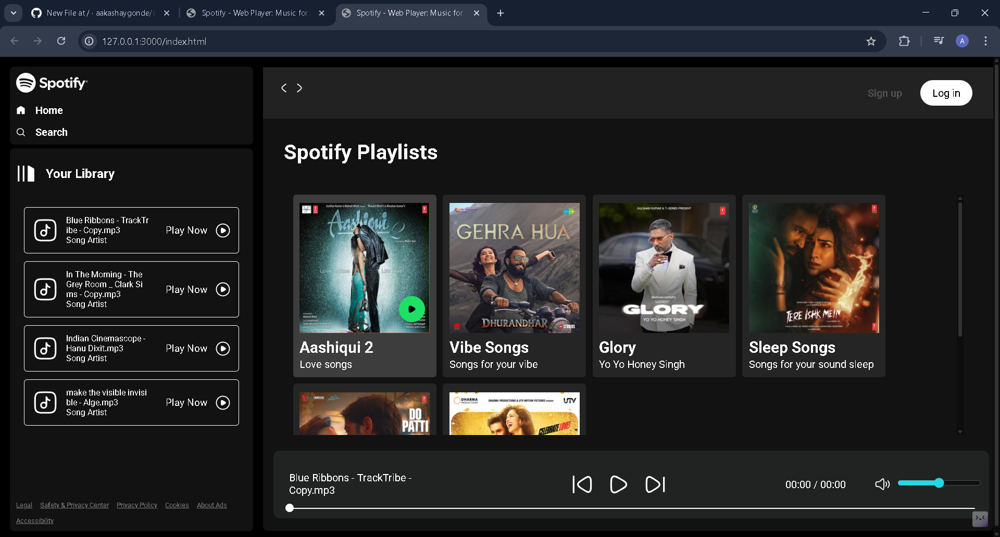

# 🎧 Spotify Clone – HTML | CSS | JavaScript

A clean and functional music player inspired by **Spotify’s UI & user experience**.  
Includes Bollywood demo songs, smooth controls, and a sleek interface built from scratch.

---

## ✨ Features
- ▶️ **Play / Pause music**
- ⏭️ **Next & Previous track**
- 🎚️ **Dynamic seekbar**
- 🎵 **Built-in Bollywood sample tracks**
- 🖥️ **Spotify-like sidebar & layout**
- 🎨 **Dark-themed UI inspired by Spotify**
- ⚡ No frameworks — pure HTML, CSS & JS

---

## 🖼️ Preview

  

---

## 🌐 Live Project  
👉 **https://aakashaygonde.github.io/spotify-clone/**  
*(Deployed using GitHub Pages)*

---

## 🧩 Tech Stack
| Tech | Use |
|------|-----|
| **HTML** | Structure |
| **CSS** | Styling (Spotify-like UI) |
| **JavaScript** | Functional music player |
| **GitHub Pages** | Hosting |

---

## 📁 Folder Layout
📦 spotify-clone
├── 📄 index.html
├── 🎨 style.css
├── 🧠 script.js
└── 📂 assets
    ├── 🎵 songs/
    └── 🖼️ images/

---

## 🚀 How to Use
1. Download or clone the repo  
2. Open `index.html`  
3. Enjoy the UI + music features  

---

## ⚠️ Disclaimer  
This is a **fan-made educational project**.  
It is not associated with, endorsed by, or connected to Spotify.

---

## ⭐ If you like this project...
Give it a **star** on GitHub. It motivates me to build more projects! ⭐

